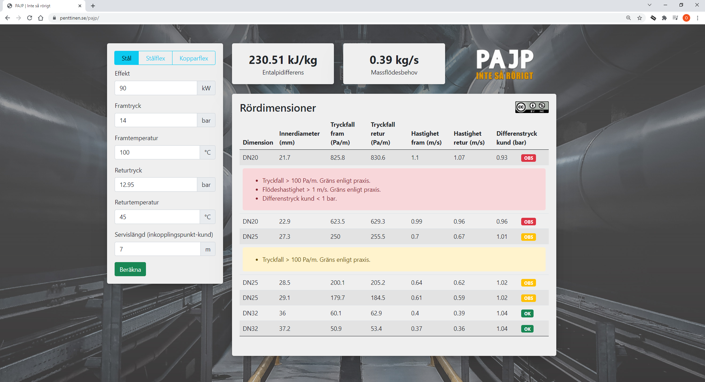

# PAJP
A web based tool for dimensioning of service pipes within district heating systems. A working demo is available [here](https://penttinen.se/pajp/).

Author: Olle Penttinen, Researcher @ [RISE Research Institutes of Sweden](https://www.ri.se/en)

## Disclaimer

The author can not be held responsible for your use of the information contained in or linked to from this software/site or any implications that may lead to. 
The author assumes no responsibility or liability for any errors or omissions in the content of this software/site. 
The information contained in this software/site is provided on an "as is" basis with no guarantees of completeness, accuracy, usefulness and without any warranties of any kind whatsoever, expressed or implied.

## Background

A long-established industry practice is to stay below a flow rate of 1 m/s and a pressure drop of 100 Pa/m in service pipes. 
The purpose is to avoid reduced comfort for customers due to high noise levels and increased wear on components. 
However, this practice is beginning to be questioned and with a more dynamic approach to system dimensioning, the competitiveness of district heating will increase.
 
This software represent one outcome from a project aimed at questioning that industry practice. The findings from the project has emerged into a software to help optimize the dimensioning of service pipes. Note that the proposed limits in the original commit is based on a combination of experiences gathered during this project.
The project consisted of a literature study, a survey among network owners, interviews of measurement technology providers and product suppliers in the district heating sector. It also included experiments in a laboratory environment. 

This project was coordinated by [FVB](https://www.fvb.se/). It was initiated and funded by [Energiforsk/Futureheat](https://energiforsk.se/program/futureheat/). 

## Functionality

The functionality of the website is relatively straight forward. The inputs to the left are used to calculate a difference in enthalpy. Preset values are entered to trigger three types of warning badges among the results. The enthalpy difference is used to calculate a massflow in order to serve the substation with the stated power. Corresponding pressure drops, velocities and differential pressures are calculated and stored for the different pipe dimensions.

Densities, viscosities and enthalpies are calculated based on [IAPWS-95](http://www.iapws.org/relguide/IAPWS-95.html) formulation in region 1. That means that the relationships are valid as long as pressure is kept above the evaporation pressure. Explicit limits for temperature and pressure are found in the source code. Negative values or NaN in the results indicates results are out of limits. (Error catching is not implemented.) The friction factor is retrieved by solving the [Colebrook-White](https://en.wikipedia.org/wiki/Darcy_friction_factor_formulae) equation iteratively. Warnings are raised if values are outside of known limits:

* Green color: Within limits
* Yellow color: Pressure drop > 100 Pa/m, Flow velocity > 1 m/s, Flow velocity > 1.5 m/s
* Red color: Flow velocity > 2 m/s in copper pipes, Flow velocity > 3 m/s in steel pipes, Differential pressure > 6 bar at customer, Differential pressure < 1 bar at customer.

An additional comment regarding thermostatic bypass valves is raised at the table footer if differential pressure > 2 bar at the connection point. 

## Adaptation

The user is adviced to check and modify the source code if it is found necessary. Recommended functions to consider are:

* `getArray(pipeType)` where pipe dimensions can be added or withdrawn
* `frictionFactor(Re, id, pipeType)` where the values of absolute pipe roughness may be changed

## Contributing

Pull requests are welcome. For major changes, please open an issue first to discuss what you would like to change.

## License

[Attribution-NonCommercial 4.0 International (CC BY-NC 4.0)](https://creativecommons.org/licenses/by-nc/4.0/)
